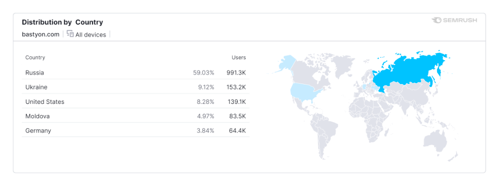
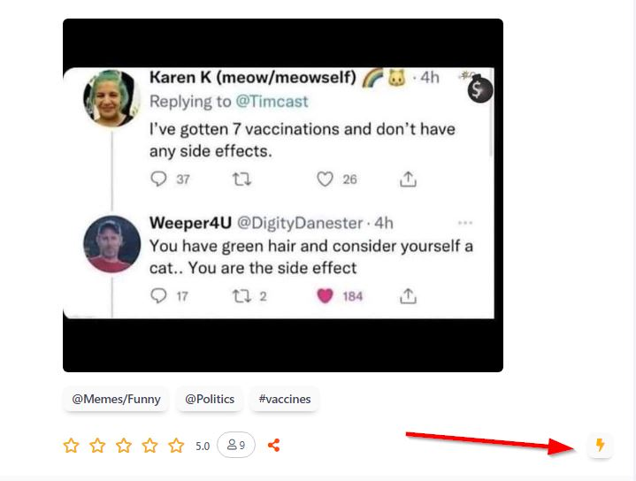
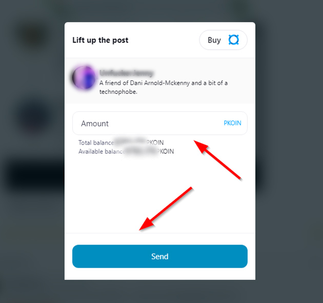

# Ways to Monetize

Bastyon, a decentralized social media platform, offers various opportunities for users to monetize their content and engagement. Here are some effective ways to make money on Bastyon

## Advertisers
Advertisers on Bastyon have accesss to one of the best CPM (cost per thousands impressions) in the industry for large networks. On Bastyon you can get to about **¢29 cents as opposed to the industry's avergae over $1**. Checkout [Calculations page](advertisement-cpm-calculation.md) for details.

<div style="display: flex; justify-content: center; align-items: center;">
    <iframe width="640" style="aspect-ratio:1.7770833333333333" src="https://bastyon.com/embedVideo.php?embed=true&amp;autoplay=true&amp;s=2cdab966cf0cce28b52597a42d9f4290489b120a2ec64a09e6a6650ffb090f66&amp;host=peertube23.pocketnet.app&amp;id=cf7b0d22-6d10-46bc-bb9b-de6d51482153" frameborder="0" allow="accelerometer; autoplay; clipboard-write; encrypted-media; gyroscope; picture-in-picture" allowfullscreen=""></iframe>
</div>


<div style="display: flex; justify-content: center; width: 100%;">
    <div style="display: flex; max-width: 600px;">
        <div style="margin-right: 40px;">
            <ul>
                <li>Are you trying to be heard on the internet?</li>
                <li>Would you like to get your content or product in front of a new dynamic audience for less than major ad networks?</li>
            </ul>
        </div>
        <div>
            <ul>
                <li>Bastyon, the blockchain social network has just released a way of promoting content, including videos.</li>
                <li>The cost of an impression on Bastyon is many times lower than on traditional ad networks.</li>
            </ul>
        </div>
    </div>
</div>

<p align="center"> Distribution by Country</p>




<p align="center">Employment Status</p>


<p align="center">Usage Demographics</p>


### How to Start Advertising

1. Launching ads on Bastyon is very simple. To do this, you need:
2. Prepare an advertising publication (video, post or article)
3. [Buy PKOIN](buying-pkoin.md)
4. Deposit the required amount of PKOIN to start advertising

#### Click the lightning bolt icon in the lower right corner of the selected post



#### Enter PKOIN in the "Amount" field and click "Send"



#### <span style="color: magenta;">Congratulations! You have launched an advertisement on Bastyon!</span>


## Content Creators

We believe that not only people should be able to communicate freely on Bastyon, but we also belive that content creators, who spend a lot of time crafting their material, should be well compensated for it. This why a new advertising and monetization program for bloggers has been launched on Bastyon.

### How It Works

Advertisers promote their products or services on Bastyon (information for advertisers can be found here in the Advertisers section or on [bastyon.com/boost](bastyon.com/boost)). The ads appear in the main feed and in author channels. All earnings from the main feed go to nodes (information on how to earn through running a [node](bastyon.com/easynode)), while earnings from author channels go directly to the authors. Bastyon is not a corporation and does not operate for profit, so all advertising revenue from channels goes to the authors.

### Participants and Payouts

At the initial stage, monetization only works on verified author channels. Over time, the program will expand to other channels with high activity. Authors can disable monetization by removing ads and forfeiting their payouts.

If you have a channel outside of Bastyon with more than 1,000 subscribers, you can [email](mailto:support@bastyon.com) to request verification.

> **IMPORTANT:**
 Authors earn proportionally to the activity and number of people on their channel. The more comments and ratings, the higher the payouts from the advertising pool. Authors have a Monetization dashboard in their settings where they can view their payout history. Payouts are made at the end of each week for activity on posts made in the past two weeks.

### Earnings Withdrawal

Authors can withdraw PKOIN through exchanges like [Tapbit.com](Tapbit.com), 
[Digifinex.com](Digifinex.com), [PKOIN.NET](https://pkoin.net), or through peer-to-peer exchanges in rubles, dollars, or any other currency. For author convenience, some older exchanges are directly available in the monetization dashboard. Other exchanges with a year or more of active history will be added to the dashboard. For withdrawal inquiries, contact support at [support@bastyon.com](mailto:support@bastyon.com)

### Payouts Calculation

Earnings vary depending on the amount of advertising in a given week and how much advertisers have paid. The money from advertisers is divided among authors, but the amount depends on the total advertising revenue and the activity on the channel (estimated based on ratings and comments). Audience growth attracts new advertisers, leading to increased earnings. Active channels can earn the equivalent of $50-75 per week or more.

### Ways to Increase Earnings

* Create more content
* Invite more people to engage

Video length does not matter on Bastyon as ads do not interrupt the video, engagement under posts is what matters. 

**Internal economy of Bastyon: Pocketcoin (PKOIN)**


## Running a Node and Staking on Bastyon

Everyone is encouraged to run Bastyon node to secure the Bastyon network. If you want to make moneyy, you can deposit at least 50 PKOIN and start earning PKOIN through staking.

What is a node? A node is a computer owned by any user of Bastyon that supports the network and earns Pocketcoin. Your computer can be one of those nodes, assuming you have at least 150 GB of free SSD space and a decent internet connection. Node has to lock some Pocketcoin in it to earn more Pocketcoin. That is called staking in cryptocurrency.

See this article for [staking calculator](https://bastyon.com/easynode)
<!--- todo: make the video work --->

<!-- <iframe src="https://pocketnetpeertube1.nohost.me/videos/embed/1f52e1c4-b9ea-40f7-abb1-5c29c200d03d" 
        style="min-height: 400px; width: 100%;" 
        frameborder="0" 
        sandbox="allow-same-origin allow-scripts" 
        allowfullscreen="allowfullscreen">
</iframe> -->


You can run your node in two ways, running a [full node](#full-node-setup-guide) or an [easy node](#easy-node-setup).

Instruction on how you can set it up:

### Setting Up Your Node

To begin earning PKOIN, you must first set up a compute node that supports the PocketNet blockchain. 
As it was mentioned above, there are two ways you can run a node. Either through a full setup or through running an easy node.

Here is a list of steps you can should take to start staking:

- **Download and Install Node Software**
    - [Full Node](#full-node-setup-guide)
    - [Easy Node](#easy-node-setup)
- **Buy PKOIN**
    - [Instructions on how to buy PKOIN](buying-pkoin.md)
- **Deposit PKOIN to Your Node Wallet**

> **Note:** To participate in staking, you must deposit a minimum of 50 PKOIN into your node wallet address. A larger deposit increases your chances of winning staking rounds.

### Staking Process

Once your node is set up and funded, you can start staking.

#### Staking Status

To check your staking status in full-node case, use the command `getstakinginfo` via `pocketcoin-cli` or the debug window in Pocketcoin-qt to verify if your node is actively staking. Look for "enabled" and "staking" fields set to "true" to confirm.
  
  Example command:
  ```bash
  $ pocketcoin-cli getstakinginfo
  ```
To check your staking in easy-node case, simply look at the Node section in your Bastyon app.

<!--todo: add an image showing the node with staking information--> 

**Expected Win Time**: The `expectedtime` field will indicate the estimated time until your next potential stake win, which varies based on network conditions and chance. The expected win time can only be viewed using the full-node setup.

### Managing Your PKOIN

After earning PKOIN through staking, you can manage your cryptocurrency effectively:

- **Sending PKOIN**: To send PKOIN to another user or exchange:
  - Open the Pocketcoin application.
  - Click on "Send," enter recipient details, and specify the amount.
  
- **Receiving PKOIN**: To receive PKOIN:
  - Open the application, click on "Receive," and generate a payment request with a QR code for easy transactions.

### **Conclusion**

By running a personal node and participating in staking within Bastyon's ecosystem, users can earn PKOIN while contributing to a decentralized platform. Ensure that you follow all setup instructions carefully and manage your wallet securely to maximize your rewards from this innovative blockchain project.

## Appendix

### Full Node Setup Guide

This guide provides instructions on how to setup a node to support the PocketNet blockchain network and Bastyon decentralized social media app. PocketNet Core node operators are rewarded in the platform cryptocurrency, PKOIN, by participating in a process called staking, which generates new blocks on the blockchain. More detail about the PocketNet network can be found at the whitepaper here

The Bastyon social media site can be visited at https://bastyon.com

#### Supported Operating Systems

The below operating systems have been validated to work with PocketNet Core software by the developer and node operator community:

- Docker
- Linux Debian Bullseye and Bookworm
- Linux Mint Cinnamon
- Linux Ubuntu 20.04 and 18.04
- Windows 10
- Windows 11

#### Minimum System Requirements

Below are the minimum system requirements to run a PocketNet node to use as a wallet, for coin staking to earn PKOIN, and to use as a local node on your home network. A node with these requirements may need to be upgraded within the next 1 - 2 years.

2 core x86-64 CPU

4GB RAM

150 GB SSD Drive

10 Mbps internet connection

#### Recommended System Requirements

The below system requirements are recommended for a node which will act as a public node to service the Bastyon front end, in addition to wallet, and coin staking capabilities. The recommended requirements should provide enough headroom to support the PocketNet network for at least 2 years into the future.

4 core x86-64 CPU

16 GB RAM

500 GB SSD Drive

100 Mbps internet connection

publicly accessible IP address and ports (see Network Setup below)

#### Linux Setup (Ubuntu, Debian, Mint, etc.)

Download the latest `pocketnetcore_*_linux_x64_setup.deb` package from the project [releases page](
https://github.com/pocketnetteam/pocketnet.core/releases)

Install package with root privilegies. To do this, open the terminal in the directory where you downloaded the installer and execute the command:

`$ sudo dpkg -i pocketnetcore_*_linux_x64_setup.deb`

On Ubuntu and many Linux distributions it will be necessary to set the open files limit to 10000 in order to prevent errors. Run `ulimit -n` to view the current open file limit. Run below command to set ulimit to 10000 open files:

`$ ulimit -n 10000`

After installation, start the GUI pocketcoin client from the command line. (If you would like to run the PocketNet Core node from the command line or in headless mode, go to the "Running a Headless Node from the Command Line" section later in this document.)

`$ pocketcoin-qt`

At this point the PocketNet Core client will start synchornizing with the network. Depending on network performance full synchronization can take anywhere from a few days to over a week to complete. If it is necessary to bring a node up in a short period of time, it is possible to download a checkpoint following the instructions in the "Starting from Checkpoint" section. However, it is recommended to allow a node to synchronize with the network on it’s own as this validates the public block chain and provides additional security and decentralization.

If it is desired to run a full node to support the Bastyon front-end app, proceed to the Network Setup section.

#### Windows Setup

Download the `pocketnetcore_*_win_x64_setup.exe` installer from the GitHub [releases page](https://github.com/pocketnetteam/pocketnet.core/releases)

Run the installer and follow the instructions, change the installation location if necessary.

Start the PocketNet Core application from the Windows Start menu. A Windows Security Alert will pop up for Windows Defender Firewall. Select "Allow access" to allow PocketNet Core through the Windows Defender Firewall for Private networks.


At this point the PocketNet Core client will start synchornizing with the network. Depending on network performance full synchronization can take anywhere from a few days to over a week to complete. If it is necessary to bring a node up in a short period of time, it is possible to download a checkpoint following the instructions in the "Starting from Checkpoint" section below. However it is recommended to allow a node to synchronize with the network on it’s own as this validates the public block chain and provides additional security and decentralization.

#### Docker Setup

Make sure that enough CPU, memory and disk space are allocated to your Docker container according to the "Minimum System Requirements" section above. You can start your node with a single command from Docker.

 ```bash
    $ docker run -d \
        --name=pocketnet.main \
        -p 37070:37070 \
        -p 38081:38081 \
        -p 8087:8087 \
        -v /var/pocketnet/.data:/home/pocketcoin/.pocketcoin \ 
        pocketnetteam/pocketnet.core:latest
 ```       
        
The node can be controlled in Docker using the `pocketcoin-cli` and `pocketcoin-tx` commands demonstrated below:

```bash
$ docker ps --format '{{.ID}}\t{{.Names}}\t{{.Image}}'
ea7759a47250    pocketnet.main      pocketnetteam/pocketnet.core:latest
$
$ docker exec -it pocketnet.main /bin/sh
$
$ pocketcoin-cli --help
$ pocketcoin-tx --help
```
More information: https://hub.docker.com/r/pocketnetteam/pocketnet.core

#### Starting Node from a Blockchain Snapshot

It is recommended to allow a PocketNet Core node to sync with the blockchain on it’s own to maximize network security and decentralization. If it is desired to bring up a node in a short amount of time, the development team provides periodic archives of the block chain which can be downloaded from https://snapshot.pocketnet.app/latest.tgz. Be sure to back up your wallet.dat file before attempting loading the blockchain from archive. The Linux bash shell commands below will delete the existing blockchain data on disk, download the blockchain archive, and extract it to the default location:

```bash
$ cd ~/.pocketcoin
$ rm -r blocks
$ rm -r chainstate
$ rm -r indexes
$ rm -r pocketdb
$ wget https://snapshot.pocketnet.app/latest.tgz
$ tar -xzf latest.tgz -C ./
```

#### Running a Headless Node From the Command Line

Running the pocketcoind command will start PocketNet core in text only mode from a command terminal. On Linux, it is possible to launch pocketcoind as a daemon process running in the background by using the -daemon parameter:

`$ pocketcoind -daemon`

To see other available options with pocketcoind:

`$ pocketcoind -?`

Commands can be sent to pocketcoind by using the pocketcoin-cli program. These same commands can also be run through the pocketcoin-qt debug terminal. Below are some common and useful commands.

Display list of available commands to send to the node:

`$ pocketcoin-cli help`

Get specific help on command name "command":

`$ pocketcoin-cli help "command"`

Send a command to the pocketcoind process to gracefully shutdown:

`$ pocketcoin-cli stop`

Display your current balance of PKOIN:

`$ pocketcoin-cli getbalance`

Generate a new receive address to have another party send PKOIN to (such as after buying PKOIN on an exchange) with a descriptive "label" to identify it later on:

`$ pocketcoin-cli getnewaddress "label"`

List receive addresses which have been previously generated or used on your node:

`$ pocketcoin-cli listreceivedbyaddress`

Send amount of PKOIN to `address`:

`$ pocketcoin-cli sendtoaddress "address" amount`

View a report of the number of PKOINs won through staking by your node:

`$ pocketcoin-cli getstakereport`

View whether or not your node is currently staking:

`$ pocketcoin-cli getstakinginfo`

View a list of connected peers (useful to verify you are connected to the PocketNet network):

`$ pocketcoin-cli getpeerinfo`

Pocketcoin-cli has the capability to send commands to a remote node to enable remote managment and headless node operation. This is an advanced topic beyond the scope of this guide, however the `pocketcoin-cli --help` lists necessary commands for remote operation.

#### Troubleshooting

If PocketNet Core fails in some manner, the first step is to check the debug.log file in the pocketcoin directory (`~/.pocketcoin on Linux, %HOMEPATH%\appdata\roaming\pocketcoin` on Windows). This can oftentimes provide clues as to what went wrong with the program.

Post to the Bastyon/Pocknet tag on the Bastion social media app to get help with node setup.

Join the Node Owners chat on Bastyon to connect with other node operators and keep up with developments and alerts! Message SnowflakeCrusher, Vortex_v, or Malaka on Bastyon to be added to the group.

To report software defects and view current issues check our [GitHub issues page](https://github.com/pocketnetteam/pocketnet.core/issues)


#### Contributions
<!---
todo: when we have an explicit contributions section, update the link below
--->

Contribute to our Github projects. We are looking for C/C++, Javascript Node JS coders, and anyone with a willingness to learn. For more information, check out our [contributions'](../../get-started.md) documentation.

### Easy Node Setup

